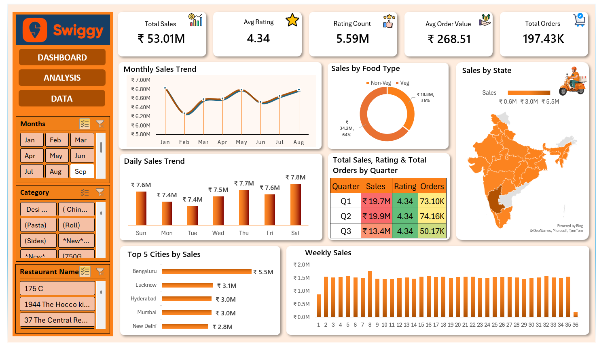

# Swiggy Sales Analysis 

## Project Overview

This project is an interactive Sales Dashboard built in Microsoft Excel using Swiggy sales data.

The dashboard provides insights into sales performance, customer ratings, order trends, food category analysis, and regional sales distribution through interactive charts and slicers.

---

## Business Insights

- Bengaluru generated the highest sales among all cities.
- Non-Veg food accounted for approximately 64% of total sales, while Veg contributed around 36%.
- Saturday recorded the highest daily sales, indicating increased weekend demand.
- Q2 achieved the highest quarterly sales performance.
- The average customer rating remained stable at 4.34, indicating consistent customer satisfaction.
- The average order value was ₹268.51 across all orders.

---

## Dashboard Preview

---

## KPIs

- Total Sales
- Average Rating
- Rating Count
- Average Order Value
- Total Orders

---

## Dashboard Features

- Interactive Slicers
- Dynamic Charts
- KPI Cards
- Monthly Sales Trend
- Daily Sales Trend
- Weekly Sales Analysis
- Sales by State
- Sales by Food Type
- Top 5 Cities by Sales
- Quarterly Performance Table

---

## Excel Features Used

- Pivot Tables
- Pivot Charts
- Slicers
- Conditional Formatting
- Maps Chart
- Donut Chart
- Bar Chart
- Line Chart
- Dashboard Design
- Excel Formatting

---

## Tools Used

- Microsoft Excel

---

## Project Files

- 📊 [Dashboard Excel File](swiggy_sales_analysis.xlsx)

- 📂 [Raw Dataset](swiggy_raw_data.xlsx)

- 🖼️ [Dashboard Screenshot](dashboard.png)
---

## Learning Outcomes

Through this project I learned:

- Data Cleaning
- Dashboard Design
- KPI Reporting
- Data Visualization
- Business Insights
- Interactive Excel Reporting

---

## Author

Mohd Affan
